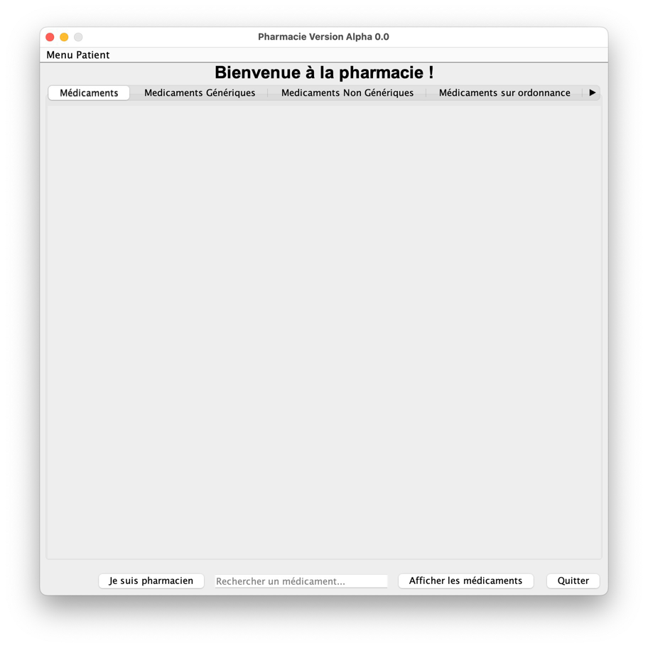

Note importante
=======================================================================================================================================================================================================================================================

Ce projet est un exemple, une proposition, une approche d'application de gestion de pharmacie développée en Java avec une interface graphique en JavaFX. Il s'agit d'un projet académique ne respectant pas le design pattern MVC(Model-View-Controller). Il est uniquement réalisé dans un but pédagogique. Des fichiers CSV font office de base de données pour stocker les informations des médicaments, des patients, des ordonnances et des commandes. Et chaque type de classe sont regroupés dans un package spécifique. Par exemple les enums sont dans un package enums, les classes de lecture et écriture dans un package io, les classes interfaces dans un package interfaces ainsi de suite pour chaques types de classes dans leurs packages respectifs définis par défaut pour l'environnement de développement Java.

Pharmacie
=======================================================================================================================================================================================================================================================
Contexte
=======================================================================================================================================================================================================================================================

Dans une pharmacie, les personnes viennent :

* Chercher des médicaments (fonctionnalité implémentée)
* Commander des préparations. (fonctionnalité implémentée)

Exemple en image :

Il y a plusieurs médicaments dans une pharmacie :

* Certains sont de stock (fonctionnalité implémentée)
* Les autres doivent être commandés (fonctionnalité implémentée)

Il y a 2 catégories de médicaments :
    
* Ceux qui sont délivrables librement (fonctionnalité implémentée)
* Ceux pour lesquels il faut une ordonnance (fonctionnalité semi-implémentée)

Exemple en image :

Pour chaque médicament, il est possible de demander la version générique plutôt que la marque (sauf pour les préparations). 

Exemple en image :

Les médecins peuvent éventuellement mettre le médicament générique sur l'ordonnance. (fonctionnalité implémentée)

Exemple en image (Dans cet exemple, le médecin a été déjà authentifier. Vous trouverez les identifiants dans src/data/authidmedecin.csv) :' :

Les génériques coûtent moins chers.

Pour commander une préparation, il faut une ordonnance. (fonctionnalité implémentée)

Exemple en image :

Une préparation contient plusieurs médicaments et est délivrable le lendemain (sauf le dimanche). (fonctionnalité implémentée)

S'il ne faut que 50% d'un médicament pour la préparation, il faut malgré tout payer le prix complet du médicament et le reste est donné au patient. 
Il peut revenir avec le reste pour une prochaine préparation. (fonctionnalité semi-implémentée)

Les médicaments commandés arrivent le lendemain (sauf le dimanche) (fonctionnalité implémentée)

Les ordonnances sont délivrées par des médecins de manière électronique à la pharmacie. (fonctionnalité semi-implémentée mais fonctionnelle)

Une ordonnance comprend :

* Références du médecin (fonctionnalité implémentée)
* Références du patient (fonctionnalité implémentée)
* Une date de prescription (fonctionnalité implémentée)
* Liste de médicaments (fonctionnalité implémentée)
* Ingrédients pour une préparation (non implémentée)

Exemple en image :

Diagramme des classes et explication des fonctionnalités du projet Pharmacie
=======================================================================================================================================================================================================================================================

Voici le diagramme des classes de l'application :

Diagramme des Classes - Application Pharmacie (proposition d'analyse UML général pour une application de gestion de pharmacie)

Légende des Classes

Médicament :

    nom: Nom du médicament
    marque: Marque du médicament (si applicable)
    generique: Indication si le médicament est générique
    prix: Prix du médicament
    quantiteStock: Quantité du médicament en stock
    prescriptionRequise: Indication si une ordonnance est requise pour le médicament

Pharmacie :

    listeMedicaments: Liste des médicaments disponibles (objets Médicament)
    listePatients: Liste des patients enregistrés (objets Patient)
    listeOrdonnances: Liste des ordonnances enregistrées (objets Ordonnance)
    listeCommandes: Liste des commandes en cours (objets Commande)

Ordonnance :

    id: Identifiant unique de l'ordonnance
    refMedecin: Référence du médecin prescripteur
    refPatient: Référence du patient
    datePrescription: Date de prescription de l'ordonnance
    listeMedicaments: Liste des médicaments prescrits (objets Médicament)
    ingredientsPreparation: Liste des ingrédients pour une préparation (si applicable)

Patient:

    nom: Nom du patient
    prenom: Prénom du patient
    adresse: Adresse du patient
    historiqueOrdonnances: Liste des ordonnances du patient (objets Ordonnance)

Pharmacien :

    nom: Nom du pharmacien
    prenom: Prénom du pharmacien
    adresse: Adresse du pharmacien
    pharmacie: Nom de la pharmacie
    listeCommandes: Liste des commandes traitées par le pharmacien (objets Commande)

Médecin :
    
    nom: Nom du médecin
    prenom: Prénom du médecin
    specialite: Spécialité du médecin
    listeOrdonnances: Liste des ordonnances prescrites par le médecin (objets Ordonnance)

Commande :

    id: Identifiant unique de la commande
    dateCommande: Date de la commande
    listeMedicaments: Liste des médicaments commandés (objets Médicament)
    statut: Statut de la commande (en cours, livrée)
    Relations entre les Classes

Préparation :

    listeMedicaments: Liste des médicaments composant la préparation
    quantiteMedicaments: Quantité de chaque médicament nécessaire pour la préparation

DemandeVersionGenerique:

    listeMedicaments: Liste des médicaments pour lesquels la version générique est demandée

Relations entre les Classes

    - Une pharmacie peut contenir plusieurs médicaments (relation 1-N)
    - Une pharmacie peut enregistrer plusieurs patients (relation 1-N)
    - Une pharmacie peut gérer plusieurs ordonnances (relation 1-N)
    - Une pharmacie peut traiter plusieurs commandes (relation 1-N)
    - Un médicament peut être inclus dans une ordonnance (relation 1-N)
    - Un médicament peut être inclus dans une préparation (relation 1-N)
    - Un médicament peut être commandé dans une commande (relation 1-N)
    - Un patient peut avoir plusieurs ordonnances (relation 1-N)
    - Un médecin peut prescrire plusieurs ordonnances (relation 1-N)
    - Un médecin peut être associé à plusieurs ordonnances (relation 1-N)
    - Un pharmacien peut traiter plusieurs commandes (relation 1-N)
    - Une commande peut contenir plusieurs préparations (relation 1-N)
    - Une préparation peut contenir plusieurs médicaments (relation 1-N)
    - Plusieurs médicaments peuvent être demandés en version générique (relation 1-N)

Fonctionnalités des Classes
=======================================================================================================================================================================================================================================================

Classe Médicament :
    
    - Gérer les informations de base sur les médicaments (nom, marque, prix, etc.).
    - Suivre la quantité de médicaments en stock.
    - Identifier si une ordonnance est requise pour le médicament.

Classe Ordonnance :
    
    - Stocker les informations d'une ordonnance (médecin, patient, date, médicaments).
    - Gérer la liste des médicaments prescrits, en différenciant les médicaments génériques.
    - Pouvoir inclure les ingrédients d'une préparation magistrale.

Classe Patient :
    
    - Enregistrer les informations personnelles des patients (nom, prénom, adresse).
    - Conserver l'historique des ordonnances délivrées au patient.

Classe Commande :
    
    - Gérer les commandes de médicaments manquants.
    - Suivre l'état des commandes (en cours, livrée).
    - Associer les médicaments commandés à une commande spécifique.

Classe Pharmacie :
    
    - Gérer les listes de médicaments, patients, ordonnances et commandes.
    - Permettre d'ajouter, de modifier et de supprimer des éléments de ces listes.
    - Proposer des fonctionnalités de recherche et de consultation des données.

Classe Préparation :
    
    - Stocker les informations sur les médicaments composant une préparation.
    - Déterminer la quantité de médicaments nécessaires pour une préparation.

Classe Pharmacien :
    
    - Gérer les informations personnelles du pharmacien (nom, prénom, adresse, etc.).
    - Associer les commandes traitées par le pharmacien à son profil.

Classe Médecin :
    
    - Stocker les informations personnelles du médecin (nom, prénom, spécialité, etc.).
    - Conserver la liste des ordonnances prescrites par le médecin.

Explication des fonctionnalités de l'application Pharmacie
=======================================================================================================================================================================================================================================================

L'application de gestion de pharmacie propose plusieurs fonctionnalités pour gérer les médicaments, les ordonnances, les patients et les commandes. Voici un aperçu des principales fonctionnalités de l'application :

Gestion des Médicaments :
    
    - Ajouter un nouveau médicament à la liste des médicaments disponibles.
    - Mettre à jour les informations d'un médicament existant (prix, stock, etc.).
    - Rechercher un médicament par son nom ou sa marque.
    - Afficher la liste des médicaments en stock et ceux qui doivent être commandés.
    - Vérifier si une ordonnance est requise pour un médicament donné.

Gestion des Ordonnances :
    
    - Créer une nouvelle ordonnance pour un patient.
    - Ajouter des médicaments à une ordonnance, en précisant s'ils sont génériques ou de marque.
    - Inclure les ingrédients d'une préparation magistrale dans une ordonnance.
    - Afficher les détails d'une ordonnance (médecin, patient, médicaments prescrits, etc.).
    - Rechercher les ordonnances par patient ou médecin.

Gestion des Patients :
    
    - Enregistrer les informations personnelles d'un nouveau patient.
    - Consulter l'historique des ordonnances délivrées à un patient.
    - Rechercher un patient par son nom ou prénom.
    - Afficher la liste des patients enregistrés dans la pharmacie.

Gestion des Commandes :
    
    - Passer une commande pour des médicaments manquants.
    - Suivre l'état des commandes (en cours, livrée).
    - Recevoir les médicaments commandés le lendemain (sauf le dimanche).
    - Afficher la liste des commandes en cours et celles déjà livrées.

Gestion des Préparations :
    
    - Créer une nouvelle préparation magistrale à partir d'une ordonnance.
    - Ajouter les médicaments nécessaires à la préparation, en précisant les quantités.
    - Calculer le coût total de la préparation en fonction des médicaments utilisés.
    - Gérer les restes de médicaments pour les préparations suivantes.

Gestion des Pharmaciens :
    
    - Enregistrer les informations personnelles d'un pharmacien (nom, prénom, adresse, etc.).
    - Associer les commandes traitées par le pharmacien à son profil.
    - Afficher la liste des commandes traitées par un pharmacien spécifique.

Gestion des Médecins :
    
    - Enregistrer les informations personnelles d'un médecin (nom, prénom, spécialité, etc.).
    - Conserver la liste des ordonnances prescrites par le médecin.
    - Rechercher un médecin par son nom ou sa spécialité.

L'application de gestion de pharmacie permet de gérer efficacement les médicaments, les ordonnances, les patients et les commandes, en offrant une interface conviviale pour les utilisateurs. Elle facilite le suivi des stocks, des prescriptions médicales et des livraisons de médicaments, contribuant ainsi à une meilleure gestion des activités pharmaceutiques.

Perspectives d'amélioration
=======================================================================================================================================================================================================================================================

L'application de gestion de pharmacie pourrait être améliorée en intégrant les fonctionnalités suivantes :

Respecter le design pattern MVC (Model-View-Controller) pour une meilleure séparation des responsabilités entre les différentes composantes de l'application. Cela permettrait de rendre le code plus modulaire, maintenable et évolutif.

Gestion des Stocks :

    - Mettre en place un système de gestion des stocks automatisé pour suivre les entrées et sorties de médicaments.
    - Proposer des alertes en cas de rupture de stock ou de péremption des médicaments.
    - Gérer les commandes automatiques en fonction des besoins des patients.

Gestion des Préparations :

    - Intégrer un module de calcul des quantités de médicaments nécessaires pour les préparations en fonction des ordonnances.
    - Proposer des suggestions de substitutions génériques pour les médicaments de marque.

Gestion des Ordonnances :

    - Permettre la génération automatique d'ordonnances électroniques à partir des prescriptions des médecins.
    - Proposer des outils d'analyse des prescriptions pour détecter d'éventuelles interactions médicamenteuses.

Gestion des Patients :

    - Mettre en place un système de suivi des traitements des patients pour améliorer la prise en charge médicale.
    - Proposer des services de consultation en ligne pour les patients afin de faciliter la communication avec les pharmaciens.

Gestion des Médecins :

    - Intégrer un annuaire des médecins partenaires pour faciliter les échanges d'informations médicales.
    - Proposer des outils de suivi des prescriptions médicales pour améliorer la qualité des soins.

Gestion des Commandes :

    - Mettre en place un système de suivi des livraisons pour informer les patients de l'état de leur commande.
    - Proposer des services de livraison à domicile pour les patients ne pouvant se déplacer en pharmacie.

